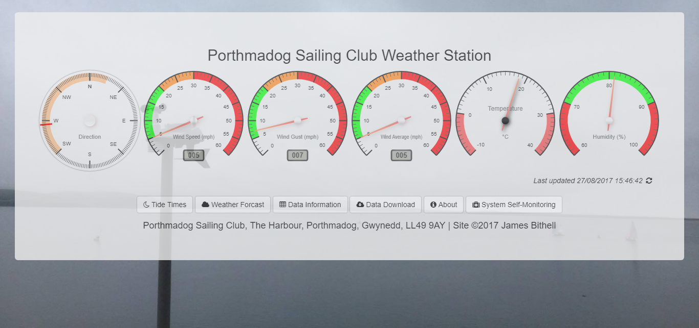

# Porthmadog Sailing Club Weather Station

Live weather station for the Porthmadog Harbour & Estuary, powered by a Davis Vantage Vue weather station.



## Architecture 

This repo is a monorepo. 

The system is made up of a number of components:

- `backend/` - A Raspberry Pi Zero W running Balena.io connects to the Davis Vantage Pro2 weather station via a USB cable. The intention was that this would be in a microservices style, but in the end it was easier to just run everything in the same script as it helped the Pi Zero cope!
  - `serialConnection` - Maintains the serial connection to the weather station, parses the data, then uploads it to an S3 bucket
- `frontend/` - the frontend web application
  - Written in Gatsby (React)
  - Hosted on Github Pages
  - Uses [gauge.js](https://github.com/bernii/gauge.js) to display data
  - Pulls data from S3 bucket

## Versioning

This project uses [Semantic Versioning](https://semver.org/), paying more attention to them from `v4.0.0` onwards

## [Balena.io](https://balena.io) Configuration 

### Device Variables

**Config Item**|**Default**
-----|-----
`LOG_LEVEL` | `silly`

### Device Configuration Variables

Following config variables are required to get serial working:

**Config Item**|**Value**
-----|-----
`RESIN_HOST_CONFIG_dtparam` | `"i2c_arm=on","spi=on","audio=on"`
`RESIN_HOST_CONFIG_enable_uart` | `enabled`
`BALENA_HOST_CONFIG_dtoverlay` | `pi3-miniuart-bt`

Edit the config.txt in balena-boot partition of the SD card and append the following lines.
```
enable_uart=1
```

## Licence 

This project is licensed under the MIT License. See the [LICENSE](LICENSE.md) file for details.